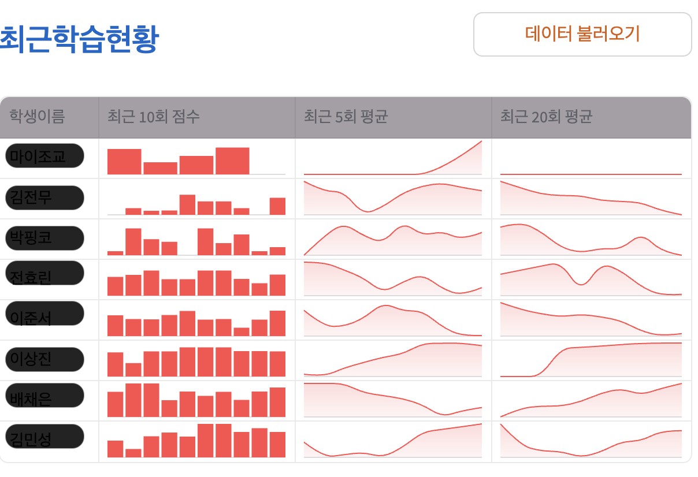
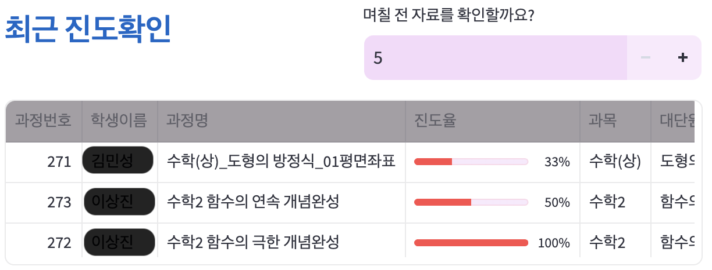
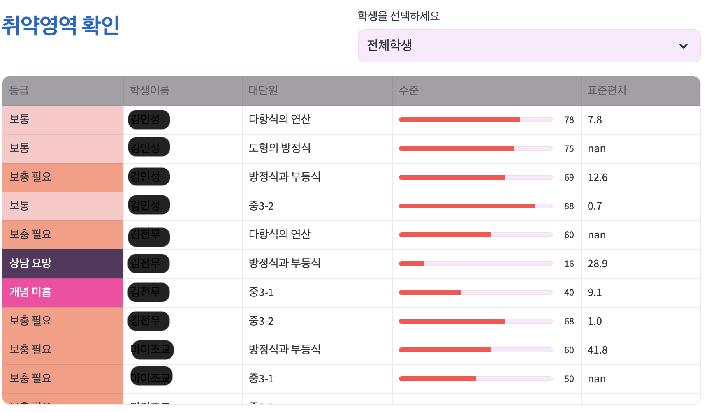
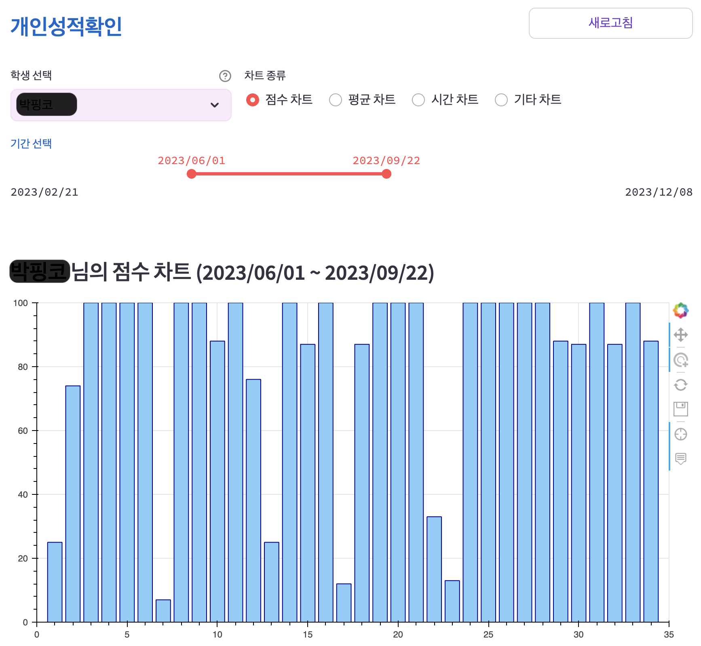
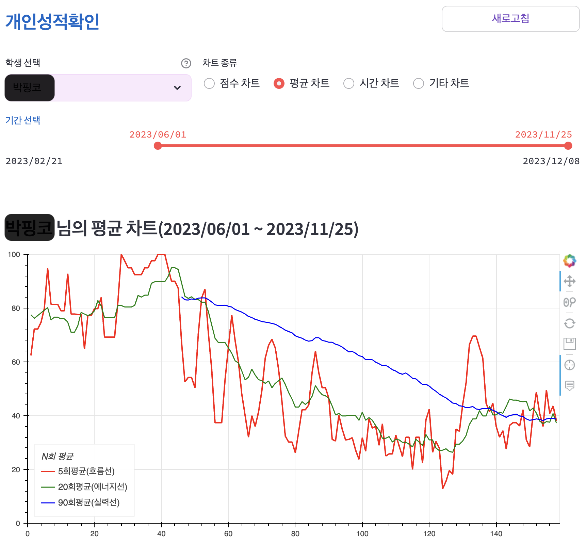
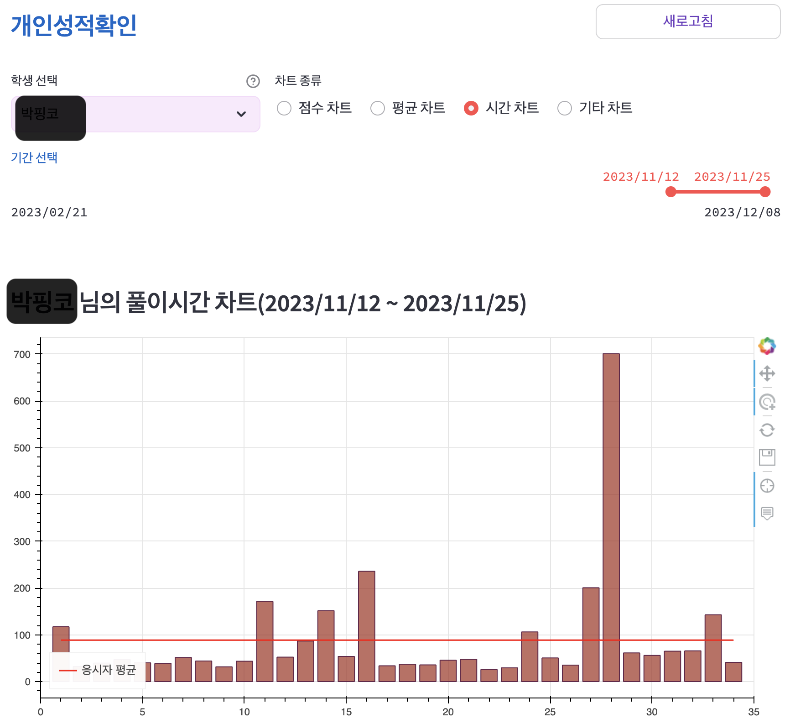
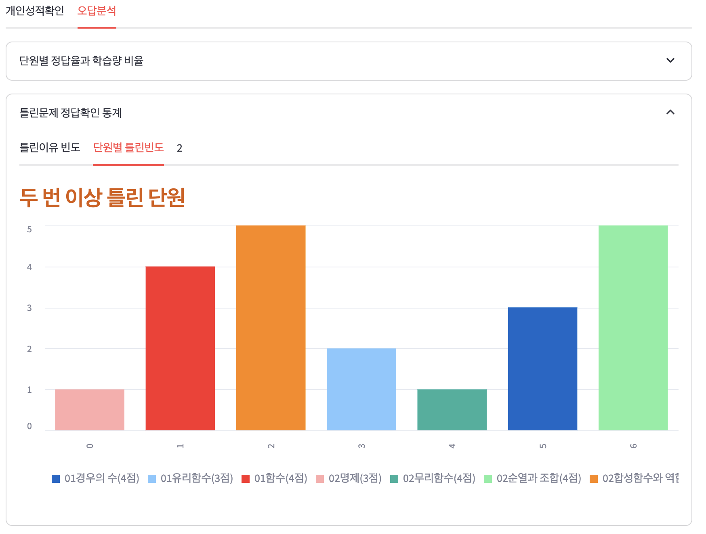
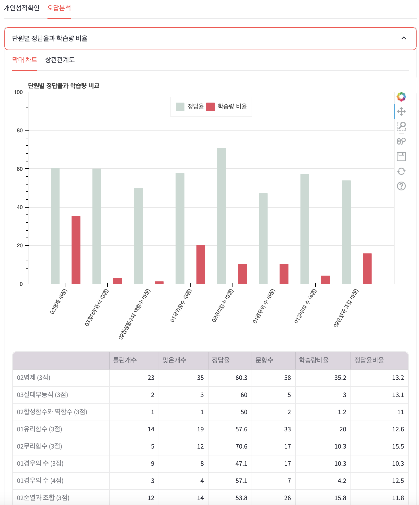
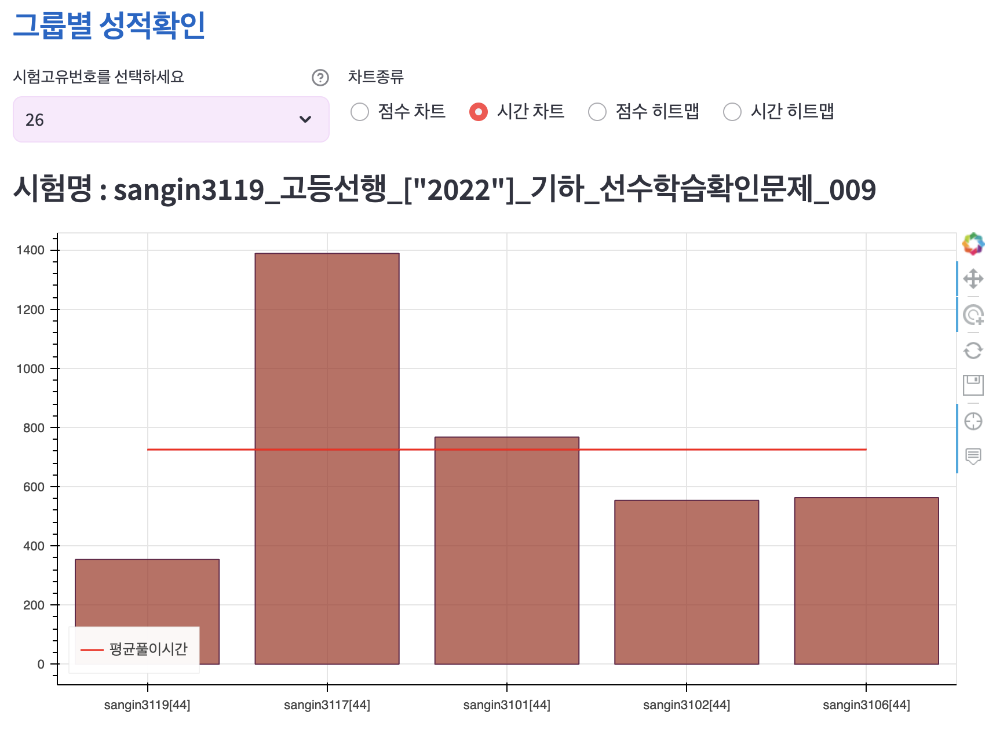
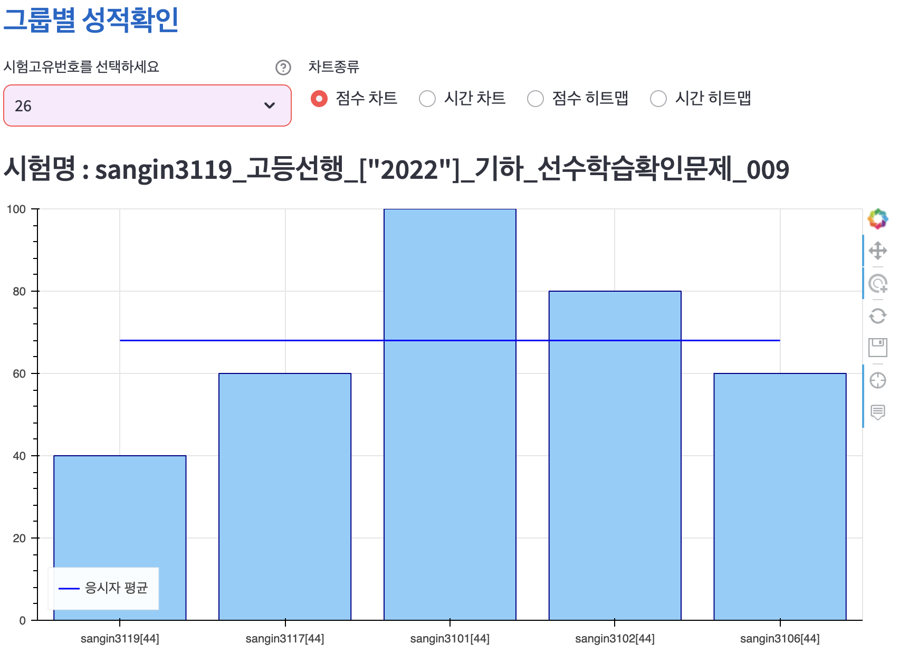

#
#
#
#

## 마이조교는 수학학원 원장님의 고민에서 출발했습니다.

1. 학생들의 **수준향상**,
2. 학부모님과 상담에서 _임팩트_ 있게 제시할 학생의 **평가자료**
3. 이걸 일일이 __수작업__ 하는 부담
4. 채점 알바를 쓰는 __비용__  
...

# 고민은 이제 그만!
마이조교로 __학생과 학부모님__, 그리고 __원장님__ 모두 만족할 결과물을 만드세요.  
학생 분석과 관리에 초점을 맞춘 운영관리도구, __마이조교__ 를 소개합니다.  

---
# 학생의 최근 학습에 대해 빠르게 피드백하세요.
#

관리하는 학생들의 현재 상태를 메인화면에서 한눈에 확인할 수 있습니다.  
* 최근 10회의 점수
* 5회 평균점수
* 20회 평균점수 

학생의 학습상태를 __직관적인 그래프__ 로 모니터링할 수 있습니다.
#
#

---

# 학생의 진도율을 실시간으로 파악하여 학생관리에 활용하세요.

#
#
---

# 눈에 띄는 취약단원

#
#

---
# 누적해서 관리된 학습 데이터

###### 테스트 결과는 기간별로 확인할 수 있고, 
###### 학부모님과 상담에 활용이 가능합니다.
#
#
---

###### 학생이 학습을 꾸준히 이어가도록 관리하여  
###### 학생의 실력을 최상으로 만들 수 있습니다.
#
#
---

###### 점점 중요해지는 시험 시간 관리!  
###### 정밀한 시간 관리로 문항별/시험별로 
###### 꼼꼼히 관리해 줄 수 있어요.  
#
#
---

###### 틀린 이유에 대한 피드백을 받는 기능입니다.  
###### 학생이 틀린 문제에 대해 스스로 이유를 생각해보게 하고,  
###### 이를 통해 교정효과를 극대화할 수 있습니다.
#
#
---

##### 수학의 정석, 
###### 집합 단원만 손때묻었던 시절을 기억하시나요?  
###### 학생이 전 영역에서 골고루 성장하도록 도울 수 있습니다.
#
#
---
# 그룹별 성적 확인

###### 응시한 시험자를 한번에 확인할 수 있어요.
###### 응시 집단에서 개별 학생의 위치를 확인할 수 있어요. 

---
#

<!-- 

$$ \frac{1}{10}$$ -->
