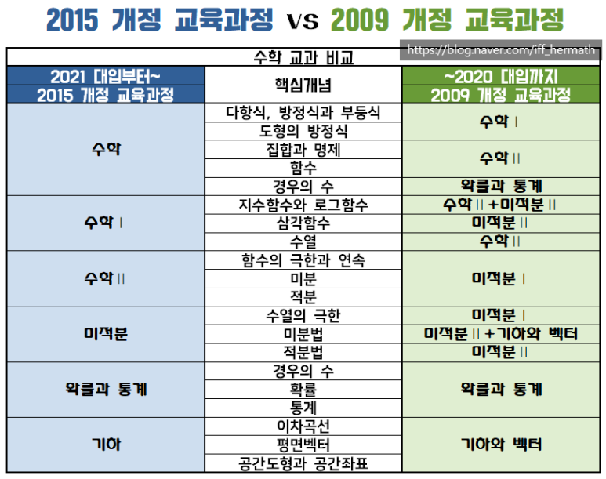

# 〔수학〕 예비고2 수학 공부 방법 【구미수학학원】 필요와충분수학에서 2015 개정 교육과정 적용 첫 학년 예비고2들의 문과/이과별 2021 수능 대비 수학 공부 방법을 추천합니다

반갑습니다. 【구미수학학원】 필요와충분수학에 오신 것을 환영합니다. ( #구미수학학원 #필요와충분수학 )

​

오늘은 2015 개정 교육과정 적용 첫학년이자 2021 대입, 2021 수능의 주인공인 예비고2들의 수학 공부 방법에 관하여 살펴보겠습니다.

2021 대입의 가장 큰 관문인 2021 수능의 출제 범위 및 시험 형태를 분석해봄으로써 보다 효율적으로 2021 수능을 대비할 수 있는  예비고2 문과 수학 공부 방법, 이과 수학 공부 방법이 무엇인지 알아보겠습니다.

​

2021 수능 대비 수학 등급 확 오르는, 수학 성적 확 올리는 예비고2 수학 공부 방법 추천, 지금부터 시작합니다. 

( #수학공부방법 #예비고2수학 #예비고2수학공부 #예비고2문과수학 #예비고2이과수학 )

『2021 대입』 예비고2들이 치르는 2021 수능은 계열 구분이 있다

2015 개정 교육과정 적용 첫 학년이 예비고2임에도 불구하고, 2021 수능은 기존의 수능 형태를 유지하고 있는 탓에 수능 수학가형과 수능 수학나형이라는 계열 구분이 존재합니다.

​

이에 대한 자세한 내용은 앞서 포스팅한 내용을 참고하시기 바랍니다. 

( #2021수능 #2022수능 #2021수능수학범위 #2022수능수학범위 #2015개정교육과정 #수능범위 #수능형태 #수학가형 #수학나형 )

http://ifandonlyif.co.kr/221417756186

[http://ifandonlyif.co.kr/221417756186](http://ifandonlyif.co.kr/221417756186)

문과와 이과의 계열 구분을 전제한 형태로 치러지는 2021 수능.

2021 수능을 효과적으로 대비하는 방법은 무엇일까요?

어떻게 하면 2021 대입을 성공적으로 마무리할 수 있게 될까요?

( #2021대입 #예비고2수학공부방법 #고2문과수학공부 #고2이과수학공부 #2021수시 #2021정시 #수능최저 #가산점 #가중치 #기하 )

​

이번에는 2021 수능 대비 수학 공부 방법을 문과와 이과로 나누어 살펴보도록 하겠습니다.

▶2021 수능 대비 수학 공부 방법, 예비고2 문과라면?

기존의 수능, 즉 계열을 구분하여 치러온 수능시험들은 문과가 선택하는 수학나형과 이과가 선택하는 수학가형 사이에 수능 수학 출제 범위의 차이가 있었음은 물론, 현격한 난이도 차이도 존재하였습니다. 

2021 수능 역시 문과와 이과의 계열 구분이 있고 이과는 수학가형, 문과는 수학나형에 응시하는 것이 일반적이지요. 

​

예비고2 문과 수학이라 불리는 2021 수능 수학나형의 출제 범위를 살펴보면 ‘수학Ⅰ, 수학Ⅱ, 확률과통계’임을 알 수 있습니다. 

이는 예비고2 이과 수학인 2021 수능 수학가형의 출제범위(수학Ⅱ, 미적분, 확률과통계)와 비교해 볼 때 난이도라는 질적 측면은 물론 양적으로 매우 적은 부분만을 학습하면 된다는 뜻이기도 합니다. 

​

또한 문과 수학인 수능 수학나형은 대입 정시모집에서 별도의 가산점을 부여하지 않으며 대입 수시모집에 주로 적용되는 수능 최저학력기준 반영이라는 측면에  있어서도 수능 수학가형에 비해 수학나형의 등급이 한 등급 낮게 반영되는 경우도 많습니다. 

즉, 문과 수학인 수능 수학나형에 응시하는 것만으로는 대입 수시/정시의 각 전형요소에서 이익을 얻는다거나 유리한 입장에 서기가 매우 어려운 것입니다. 

​

따라서 예비고2 문과의 경우 수학을 공부함에 있어 예비고2 이과 학생들이 공부하는 만큼의 시간과 노력을 들이는 것은 그리 효율적인 선택이 아닙니다.

예비고2 문과라면 가장 먼저 해야 할 일은 2021 대입에서 수능 최저를 어느 정도 맞추는 것이 목표인지, 또 수능 수학나형의 백분위가 어느 정도 나오기를 희망하는지 등 2021 대입과 연관된 명확한 목표를 세우는 것입니다. 

그다음으로 해야 할 일은 자신이 세운 목표를 달성하는 정도의 노력만을 수학에 쏟고 나머지 시간과 노력은 자신이 지원하고자 하는 대학/학과에서 보다 높은 가중치를 부여하는 수능 응시영역의 점수를 높이는 데에 기울여야 하는 것이지요.

​

무작정 열심히 공부하면 된다는 식의 막연한 결심만으로 2021 대입에 관한 정보 없이 2021 수능을 준비하는 것은 무척 위험한 일입니다. 

문과를 선택한 예비고2들 중 수능 수학나형의 점수만으로 2021 대입, 2021 수능에서 우위에 설 수 있으리라 생각한 학생들이 있다면  지금이라도 당장 기본적인 대입의 전형요소/전형방법들부터 살펴보시기 바랍니다.

▶2021 수능 대비 수학 공부 방법, 예비고2 이과라면?

그렇다면 예비고2 이과의 경우는 어떨까요? 

2021 수능 수학가형에 응시할 예비고2 이과 학생들에게는 희소식일 수도 아닐 수도 있는, 2021 수능 수학 출제 범위만의 특수성이 존재합니다. 

바로 ‘기하’ 과목의 배제입니다. 

​

예비고2들보다 한 해 먼저 치러지는 2020 수능은 2009 개정 교육과정 적용의 마지막 해이므로 수능 수학가형의 출제 범위에 미적분Ⅱ, 확률과통계, 기하와벡터가 포함되어 있습니다.

또한 예비고2들보다 한 해 뒤에 치러지는 2022 수능은 2015 개정 교육과정을 새로운 수능 형태에 접목하여 실시하게 되므로 수학 공통과목(수학Ⅰ, 수학Ⅱ)에 수학 선택과목(미적분, 확률과통계, 기하)을 더하여 치르도록 구성되어 있습니다.

종합해보면 예비고2들이 치르는 2021 수능 수학에서만 기하 과목이 완전히 빠져있는 것입니다. 

​

단순히 양적인 측면에서만 생각한다면 기하 과목이 배제된 2021 수능은 2020 수능, 2022 수능 등에 비해 수능 수학가형을 대비하기 위한 수학 학습량이 비교적 적은 것으로 판단됩니다. 

그러나 대입의 커다란 변수인 재수생/N수생 등을 고려한다면 2021 대입을 치르는 예비고2들은 상당 부분 피해를 입게 될 것이란 것 또한 명백한 사실입니다. 

​

따라서 2021 수능을 대비하는 예비고2 이과 학생들은 2021 대입에서 성패를 가를 수 있도록 만반의 준비 태세를 갖추어야 합니다. 

수능 수학가형에 응시하는 경우 대입 정시모집에서 가산점을 받을 수 있는 곳은 어디인지, 대입 수시모집에서 뛰어난 수학 실력만으로 대학 진학이 가능한 곳이 있는지 등 2021 대입과 관련하여 수시/정시모집 각각의 지원전략을 세워보면서 수능 수학가형의 성적을 상위권으로 끌어올리는 노력을 계속해서 해나가야 합니다.

​

이과를 선택한 이상 수학과 과학에 많은 시간과 노력을 기울이는 것은 너무나 당연한 일입니다.

이과 학생들의 수학 학습시간에 관하여서는 대부분의 고등학생들이 이미 너무나 잘 알고 있을 것이므로, 더 이상의 언급은 하지 않겠습니다. 

​

▶2021 수능 수학, 문과/이과별 효율적인 학습전략이 곧 성패를 좌우한다

2021 수능까지 남은 시간은 예비고2 문과 학생에게도 예비고2 이과 학생에게도 동일합니다. 

정해진 시간 안에 최대한의 효과, 최선의 결과를 만들어내기 위해서는 효율적인 학습전략을 수립하여 실천해가는 것이 중요합니다.

( #효율적인학습전략 #수학성적상승 #수학등급향상 #수학잘하는법 )

​

2020 수능, 2021 수능, 2022 수능이 모두 다름은 물론 2020 대입, 2021 대입, 2022 대입도 모두 다르지요.

이처럼 해마다 바뀌는 수능과 대입제도의 저변에는 2015 개정 교육과정이라는 새로운 교육과정의 적용이 깔려 있습니다. 

2015 개정 교육과정에 대한 근본적인 이해를 바탕으로  2021 수능/2021 대입을 준비해야 합니다.

2021 수능 수학을 대비하기 위한 학습량, 학습시간이 문과 수학과 이과 수학에 따라 철저히 달리 계획되어야 하며 2021 대입과 연계하여 학생 개개인마다 수시/정시에서의 유/불리를 따져가며 궁극적인 2021 수능 수학 공부 방법을 수립하고 실천해나가야만 2021 대입 성공신화의 주인공이 될 수 있습니다.

​

※2021 수능 대비 예비고2 문과 수학, 예비고2 이과 수학 커리큘럼은 아래를 참고해 주시기 바랍니다. 

http://ifandonlyif.co.kr/221415001373

[http://ifandonlyif.co.kr/221415001373](http://ifandonlyif.co.kr/221415001373)

​

변화의 속도가 매우 빠른 요즘입니다.

구태의연한 태도를 버리고 보다 기민하고 영민하게 대입과 수능을 준비해나가시기 바랍니다.

​

오늘도 건강한 하루 보내세요. 

