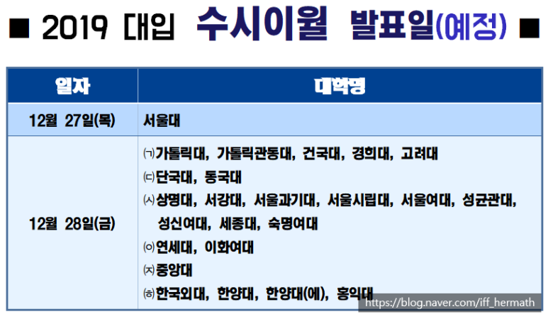

# 〔대입〕 2019 수시 이월 인원 발표 예정일은? 【구미수학학원】 필요와충분수학과 함께 대학별 수시 추합 최종 등록 마감일 기준 2019 수시 이월 인원 발표 예정일을 알아봅시다

반갑습니다. 【구미수학학원】 필요와충분수학에 오신 것을 환영합니다. ( #구미수학학원 #필요와충분수학 )

​

2019 대입 수시모집의 추가 합격자 발표(수시 추합)가 한창 이루어지고 있는 시기입니다. 

대학별로 수시 추합(수시 충원) 일정과 등록 일정이 모두 다르니, 자신이 지원한 대학의 스케줄을 반드시 꼼꼼하게 확인하는 것이 필요합니다.

​

오늘은 수시 추합이 끝나기를 조금 다른 목적으로 기다리는, 정시러/정시파이터들을 위하여 포스팅을 해볼까 합니다. 

​

2019 정시모집에 지원하고자 하는 학생들이 가장 궁금해하는, 2019 수시 이월 인원 발표 예정일에 관해 인 서울 주요 대학들을 중심으로 정리해보도록 하겠습니다. 

2019 수시 이월 인원 발표, 언제쯤 이루어질까?

2019 수능이 역대급 불수능이었던 만큼, 수능 최저를 맞추지 못한 수험생들이 대거 쏟아지면서 정시모집에 대한 관심이 매우 높아졌습니다.

이러한 추세는 정시모집에서 얼마나 많은 신입생을 선발할 것인가 하는 문제에 대한 관심으로 자연스레 이어지게 되지요.

​

정시모집 최종 인원은 수시모집이 완전히 마무리된 시점에야 알 수 있습니다. 

대학별로 수시모집에서 미등록(미충원) 인원을 수시 이월 인원으로 처리함으로써 정시모집에 포함시켜 정시모집 최종 선발인원을 발표하기 때문입니다. 

​

따라서 2019 수시 이월 인원 발표 예정일이 언제인지 알아보고 싶다면 각 대학별 수시 추합(충원) 최종 등록 마감일이 언제인가를 따져보면 됩니다. 

​

대부분의 대학에서는 수시 추합(충원) 최종 등록 마감일 다음날을 수시 이월 인원 발표 예정일로 정해두고 있습니다. 

​

『2019 대입』 2019 수시 이월 인원 발표 예정일, 인 서울 주요 대학들을 중심으로 정리해보자

2019 수시 이월 인원 발표는 서울대가 12월 27일, 그리고 나머지 인서울 주요 대학들이 12월 28일에 실시할 것으로 예상됩니다. 

​

서울대의 경우 2019 수시 추합이 단 한 차례 실시되며 서울대 수시 추합 최종 등록 마감이 12월 26일 오후 4시로, 다른 대학에 비해 이른 편입니다. 따라서 2019 수시 이월 인원 발표도 다른 대학들보다 하루 먼저인 12월 27일에 이루어질 것으로 보입니다. 

​

인 서울 주요 대학들 중 2019 수시 추합 최종 등록이 12월 27일 오후 4시까지 이루어지는 대학으로는 가톨릭대, 가톨릭 관동대, 건국대, 고려대, 단국대, 동국대, 상명대, 서강대, 서울과기대, 성균관대, 중앙대, 한국외대, 한양대, 한양대(에리카) 등을 들 수 있습니다.  

사실상 인서울 주요 대학들의 상당수가 이에 해당하므로 2019 수시 이월 인원 발표 예정일이 12월 28일인 대학이 거의 대다수가 될 것임을 알 수 있습니다. 

( #서울대수시이월 #고려대수시이월 #연세대수시이월 #서강대수시이월 #성균관대수시이월 #한양대수시이월 #이화여대수시이월 #중앙대수시이월 #경희대수시이월 #서울대수시등록마감 )

▶2019 수시 마감 = 2019 정시 시작◀

2019 대입, 2019 수시가 끝나는 시점이 곧 2019 정시가 시작되는 시점입니다. 

정시 배치표를 보고 나름의 지원전략을 세워가면서 2019 정시모집을 준비하고 있을 수험생 여러분!

이제 가장 중요한 2019 수시 이월 인원 발표만이 남았습니다. 

​

정시모집 최종 인원이 얼마나 될 것인가의 문제는 지원하고자 하는 대학/학과의 경쟁률에 직결되는 요소일 뿐만 아니라 수시 이월 인원/규모에 따라 정시 배치표가 다시 만들어지기도 하는 매우 중대한 문제입니다.

​

대학별/모집단위별 수시 이월 인원 발표를 반드시 철저히 확인함으로써 2019 정시모집 최종 인원을 정확히 알고 정시모집에 지원해야 한다는 사실, 잊지 마세요.

​

날씨가 많이 춥습니다.

오늘도 건강한 하루 보내시기 바랍니다. 

