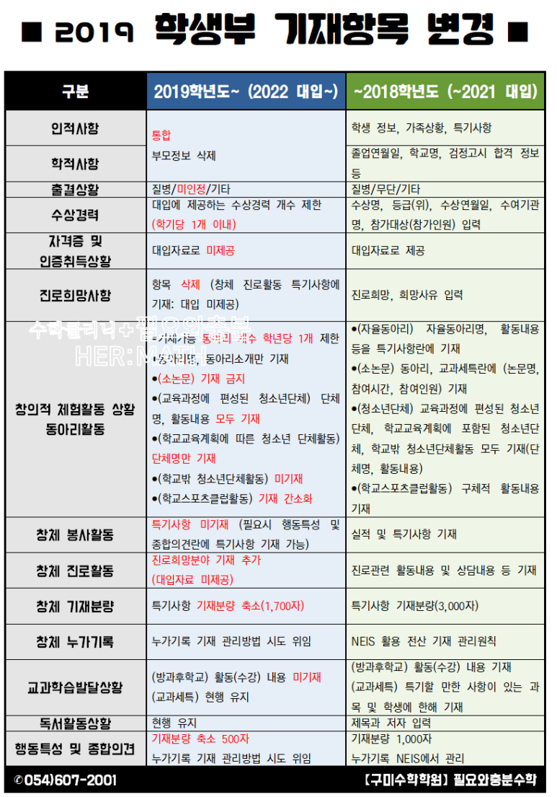
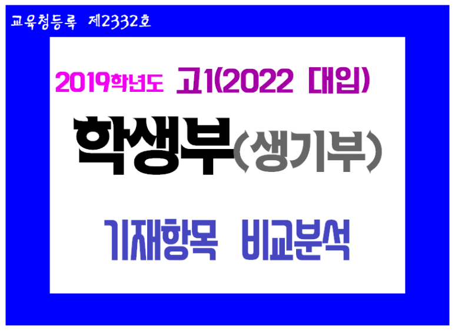

# 2019학년도 고1 학생부(생기부) 기재항목 어떻게 바뀌나 【구미수학학원】 필요와충분수학과 함께 2019 학생부기재요령, 어떤 변화가 생기는지 기재항목별로 정리해 봅시다

반갑습니다. 【구미수학학원】 필요와충분수학에 오신 것을 환영합니다. ( #구미수학학원 #필요와충분수학 )

​

2019학년도 고1이 될 현재 예비고1들은 고입은 물론 대입에서도 큰 변화를 겪는 학년입니다.

​

※2015 개정 교육과정을 충실히 반영한 새로운 형태의 수능인 2022 수능의 수학 출제 범위 등에 관하여는 앞서 자료를 포스팅한 바 있으니 참고하시기 바랍니다.

http://ifandonlyif.co.kr/221417756186

[http://ifandonlyif.co.kr/221417756186](http://ifandonlyif.co.kr/221417756186)

오늘은 2022 대입의 주역인 2019학년도 고1들의 고등학교 생활기록부, 즉 2019 학생부(생기부)에 대해 알아보겠습니다 

​

기존의 학생부 기재항목들과는 달라진 2019 학생부(생기부), 구체적으로 어떤 기재항목들이 있는지, 2022 대입에 반영이 되는 부분과 반영되지 않는 부분은 무엇인지 등 2019 학생부(생기부) 기재항목의 변화상에 대해 낱낱이 살펴봅시다. 

( #2019학생부 #2019학생부기재요령 #2019고1학생부 #예비고1 #2022대입 #2022대입학생부 #2022대입생기부 #고등학교학생부 #고등학교생기부 #2019학생부기재항목 #2019학생부기재 #2019학생부기재항목변화 #2019학생부변화 #2019학생부변경 #2019생기부변화 )

​

2019 학생부(생기부), 기존 학생부에 비해 기재항목/기재 분량 감소

2019학년도 고1부터 학생부(생기부)의 기재항목이 다소 바뀐다는 이야기, 아마도 들어보셨으리라 생각합니다. 

2019 학생부에서는 기존의 학생부(생기부) 기재항목에서 불필요하다고 생각되는 정보들을 삭제하거나 통합하는 등의 시도를 통하여 학생부 기재항목 개수를 줄였음은 물론, 각 항목별 기재 분량도 대폭 줄였습니다. 

​

고2, 고3들에 비해 비교적 단출해진 2019 고1 학생부(생기부) 기재항목을 표로 일목요연하게 정리해 보면 다음과 같습니다. 

2019 학생부 기재항목 변화에 대한 항목별 비교 분석

2019 학생부에서는 인적사항과 학적사항을 통합하면서 학생 개인정보 부분에서 불필요하다고 생각되는 부분들을 과감히 삭제합니다. 

​

출결상황에서는 ‘무단’이라는 용어 대신 2019 고1 학생부(생기부)부터 ‘미인정’이라는 용어를 사용합니다. 

​

2022 대입에 반영 가능한 수상의 개수는 학기당 1개로 제한합니다. 고2, 고3의 경우 엄청난 양의 수상실적을 대입에 반영할 수 있는 것과 대조적입니다. 

​

자격증 및 인증취득상황은 2022 대입에 반영되지 않습니다. 

​

학생들의 꿈과 희망을 기록하던 진로희망사항은 아예 항목 자체를 삭제하고 진로와 관련된 특기사항은 창의적체험활동의 진로활동 특기사항란에 기록은 하되, 역시 2022 대입에 반영되지는 않습니다. 

​

창의적체험활동의 경우 동아리활동과 관련하여 2019 고1 학생부(생기부)부터 크고 작은 변화들이 많이 있습니다. 

무엇보다도 가장 눈에 띄는 변화는 소논문 기재 금지입니다. 고2, 고3의 경우 소논문이 동아리활동과 교과세특에 기재되는 것에는 변함이 없습니다. 나머지 창의적체험활동의 세세한 변화들은 위의 표를 참고하시기 바랍니다. 

​

교과학습발달상황과 관련하여 2019 고1 학생부(생기부)에는 방과후학교 수강내역, 활동내역을 기재하지 않습니다. 고2, 고3들은 방과후학교 수강내역, 활동내역을 모두 기재합니다. 

​

다음으로 많은 수험생들의 관심이 집중되는 항목 중 하나인 교과세특입니다. 고2, 고3의 경우 특기할만한 과목/학생에 한하여 교과세특을 기록하도록 하고 있는데, 2019 고1 학생부(생기부)에서도 이것은 기존과 동일하게 유지됩니다. 

​

마지막으로, 학생부의 마무리에 해당하는 행동발달 및 종합의견은 기재 분량이 기존 1,000자에서 500자로 줄어들었습니다. 불필요한 수식어나 미사여구를 빼고 진솔하고 객관적인 내용을 담으라는 것으로 해석됩니다.

​

( #2019학생부기재분량 #창체 #동아리 #소논문 #교과세특 #행동발달상황및종합의견 #진로희망 #창의적체험활동 #봉사활동 #수상경력 #수상개수 #동아리개수 )

​

2019 학생부 기재항목 변화는 고1부터 적용

▶2022 대입에 반영

2019학년도 고1이 될 준비를 한창 하고 있을 예비고1 여러분!

다들 겨울방학 동안 고등학교 과목들을 선행학습할 계획들을 세워 실천해나가고 있으리라 생각합니다. 

​

그에 더하여 고등학교 입학 전에 2022 대입에서 기본서류에 해당하는 2019 학생부가 어떻게 바뀌는지, 고2/고3들의 학생부와 비교하여 어떤 항목이 사라지고 또 유지되는지 등에 대해 미리 알아두기를 바랍니다.

고등학교에 진학하여 불필요한 노력은 줄이고, 꼭 필요한 데에 노력을 기울이기 위해서는 2019 고1 학생부(생기부)가 어떻게 구성되고 기록되는지를 알고 있어야 합니다.

​

예비고1 여러분에게 펼쳐질 앞으로의 고등학교 생활, 그 3년의 기록이 될 2019 학생부(생기부)에 일어난 변화에 관심을 갖고 미리 알아보면서 차근차근 대비해나간다면 2022 대입에서 만족스러운 학생부를 갖게 될 것입니다. 

​

2018년도 며칠 남지 않았습니다. 

한 해의 마무리 잘 하시기 바랍니다. 

