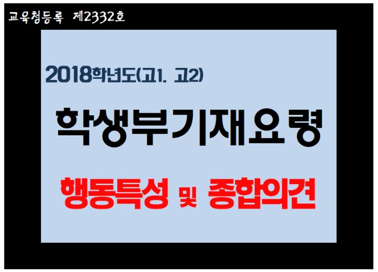

# 〔행동특성 및 종합의견〕 학생부 행동특성 및 종합의견은 어떻게 써야하는지, 2018학년도 학생부 기재요령 중 행동특성 및 종합의견 기재예시(생기부 행발 예시)를 함께 알아봅시다

반갑습니다. 【구미수학학원】 필요와충분수학에 오신 것을 환영합니다. 

​

오늘은 2018학년도 학생부 기재요령을 바탕으로 고등학교 학생부(생기부) 행동특성 및 종합의견의 기재예시에 대해 살펴보겠습니다. 

​

교육부에서 제시하고 있는 학생부 기재요령에 따른 행동특성 및 종합의견 기재예시, 소위 ‘행발 예시’라 불리는 학생부 가장 마지막 항목인 행동특성 및 종합의견 작성방법에 대해 알아봅시다. 

​

( #행동특성및종합의견 #행동특성및종합의견예시 #행발예시 #행동특성및종합의견예시문구 #행발예시문구 #행동특성및종합의견기재예시 #행발기재예시 #학생부기재예시 #학생부기재요령 #생기부기재요령 #2018학생부기재요령 #고1학생부 #고2학생부 #고1행발 #고2행발 #2018학년도고1학생부 #2018학년도고2학생부 #고등학교학생부 #고등학교생기부 #학생부예시문구 #교육부예시문구 #생기부행발 #학종 #자기소개서 #자소서 #구미수학학원 #필요와충분수학 )

행동특성 및 종합의견 기재요령

교육부 표준 가이드라인

“학생의 학습, 행동 및 인성 등 학교생활에 대한 상시 관찰·평가한 누가기록을 바탕으로 다양한 분야에서의 구체적인 변화와 성장 등을 종합적으로 기재함.”

​

교육부에서 제시하고 있는 학생부 기재요령에 따르면 행동특성 및 종합의견 항목은 위의 가이드라인에 따라 작성되는 것이 원칙이며 표준입니다. 

행동특성 및 종합의견은 학생부 구성에 있어 가장 마지막 항목인 동시에, 담임교사가 학생을 1년간 관찰한 내용을 총체적으로 입력하도록 되어 있으므로 매우 포괄적인 내용을 담아내는 항목이기도 합니다. 

​

행동특성 및 종합의견 기재예시

2018학년도 학교생활기록부 기재요령, 교육부

2018학년도 학생부 기재요령에 제시된 행동특성 및 종합의견의 기재예시는 다음과 같습니다. 

​

1. 과학적 상상력과 창의력이 뛰어난 학생으로 수업 시간에 배운 새로운 상황에 대한 다양한 상황을 제시하면서 질문을 이어가는 모습을 보임. 자신만의 시간 관리 노트를 만들어 그날의 중요한 일과를 시간 배분을 통하여 수행하는 습관이 있으며, 당일에 해결하지 못한 일은 다음날의 시간 관리 계획에 넣어 자신을 제어하고 관리하는 능력을 보여줌. 일률적으로 해야 하는 과제나 반복 학습에는 흥미가 낮은 반면, 학습 과제를 자신만의 흥미로운 방식을 스스로 찾아내어 수행하는 것을 좋아함. 또한 어떤 현상을 관찰하는 것보다는 전체적으로 통찰하고, 그 의미를 조합하고 숨은 뜻을 잘 파악하는 학습을 선호함. 

​

2. 외교관이라는 뚜렷한 진로 희망을 가지고 영어 학습에 많은 노력을 기울인 결과 폭넓은 어휘력을 바탕으로 영어 회화에서 다양한 상황 표현력이 탁월함. 진로종합검사 결과와 자신의 꿈이 일치하여 꾸준히 노력하고 있으므로 긍정적인 성장이 기대됨. 독서활동을 즐겨하며, 독서 감상문, 독서 퀴즈, 독서 감상화 등으로 다양하게 정리하여 독서활동을 내면화 함. 독서활동에서 관심과 호기심을 자극하는 분야에 대해서는 집중적으로 몰입하여 관련 도서를 찾아 읽고, 자료를 탐색하는 등 지적 호기심과 문제 해결을 모색하는 활동을 즐겨함. 또한 새로운 분야에 적극적으로 도전하는 진취적인 성향과 자신의 관심 분야에 집중적으로 몰입하는 성격으로 , 주어진 과제에 흥미를 보이고 어려운 문제를 해결하기 위해 다방면으로 해결 방법을 모색하는 창의적이고 열정적인 모습을 보임.

​

3. 예의가 바르며 자신이 맡은 일에 최선을 다하려는 자세를 가진 학생임. 평소 쉬는 시간과 점심시간에 학교 도서관에 들려 책을 많이 빌리거나 읽으면서 지식과 사고력의 폭을 넓히기 위해 노력함. 교내 도서관에서 실시한 9월 독서의 달 행사 내용 중 도서관에 정리되지 않은 책들을 정리하여 도서부원에게 확인을 받는 ‘책 정리 미션’과 책 제목을 맞히는 ‘책 제목을 맞혀라!’에 적극적으로 참여함. ‘한국의 CSI’를 읽고 대한민국 최고의 과학 수사원을 꿈꾸는 학생으로 과학자 초청 강연회를 비롯한 과학 관련 분야의 행사에 열심히 참여하였으며 특히 실험탐구 방과후학교에서 스스로 실험 주제를 정하고 탐구하는 활동함. 

​

4. 늘 배려하는 습관으로 단체 활동에서도 급우들과 협력하여 늘 화합하는 분위기를 만들어 가는 학생으로서 팀장으로 활동을 할 때에는 팀원들도 적극적으로 협력하여 주어진 과제를 수행하는 리더십을 가진 학생임. 또한 팀원으로 활동을 할 때에도 팀원들과 적극적으로 협력하여 팀장을 돕는 성품을 지닌 학생임. 따라서 이러한 활동을 바탕으로 직업기초능력인 대인관계 능력을 갖추게 되었으며 특히 리더십 능력이 돋보임. 

​

교육부에서 제시하고 있는 행동특성 및 종합의견 기재예시(행발 예시)는 학생부 기록에 있어 기준이자 참고자료로 활용하여야 합니다. 

절대 위의 문구를 복붙(복사해서 붙여넣기)하여 똑같은 문구로 학생부 행발을 채워넣는 실수는 하지 않아야 한다는 점, 꼭 기억해 두시기 바랍니다. 

​

교육부에서 제시하는 학생부 기재요령 예시문구, 

100점 만점에 60~70점 정도

교육부에서 제시하고 있는 학생부 기재요령에 따른 각 항목별 기재예시들을 살펴보면, 매우 보편적인 내용으로 구성되어 있음을 알 수 있습니다. 

학교생활기록부(학생부 또는 생기부)는 전국의 중·고등학생을 대상으로 기록·관리되는 자료이지요. 

따라서 교육부에서는 어느 개별 학생만을 위한 특별한 기재예시를 제시하기보다는, 비교적 보편적이고 일반적인 내용으로 학생부 기재예시를 제시하고 있습니다. 

​

교육부의 학생부 기재요령은 말 그대로 참고자료이자 표준 가이드라인으로 활용하라는 것입니다. 

이러한 점을 충분히 인지한 후에 학생부의 각 항목들을 채워나가야 합니다. 

즉, 교육부에서 제시하고 있는 학생부 예시문구 이상의 내용들로 개개인의 학생부가 만들어져야 하는 것입니다. 

​

1년간 충실히 해온 학교생활의 내용을 총체적으로 담아낼 수 있는 항목이 바로 행동특성 및 종합의견입니다. 

다른 항목들에서는 담아내기 어려운 내용들까지도 포괄적으로 기록할 수 있는 항목이지요. 

​

수시 학종(학생부종합전형)에서 필요한 자기소개서를 작성함에 있어서도 행동특성 및 종합의견(행발)은 매우 중요한 항목이자 요소로 작용하는 만큼, 학생부 행동특성 및 종합의견(행발)의 기재에 있어 소홀함이 없도록 해야 할 것입니다. 

​

날씨가 매우 춥습니다.

건강 관리에 유의하시기 바랍니다. 

